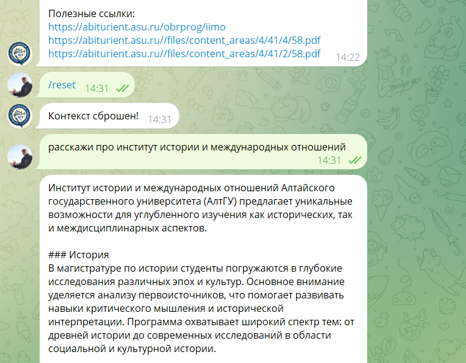
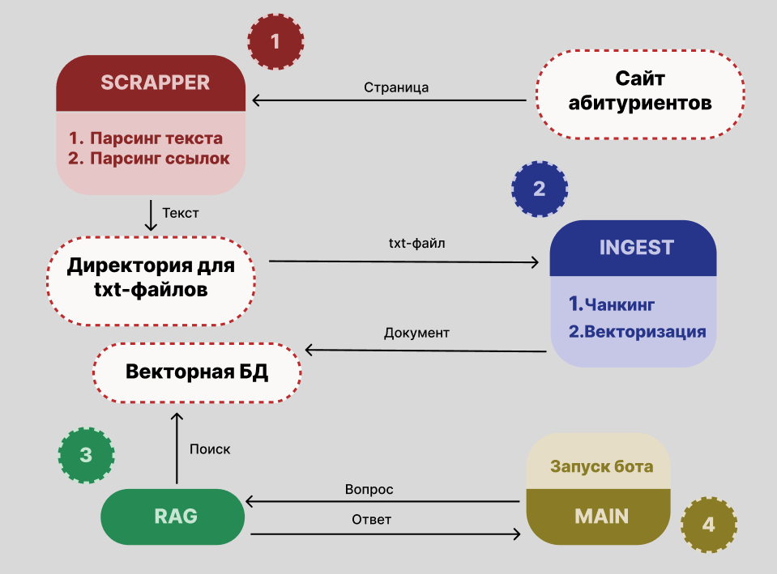
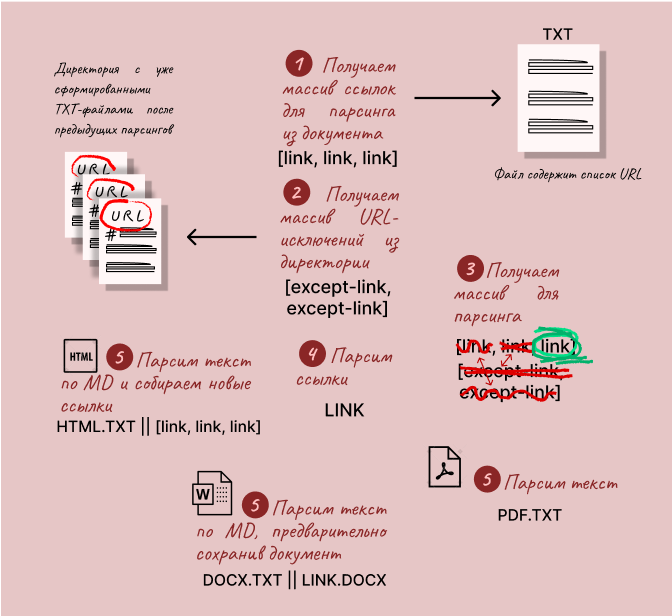
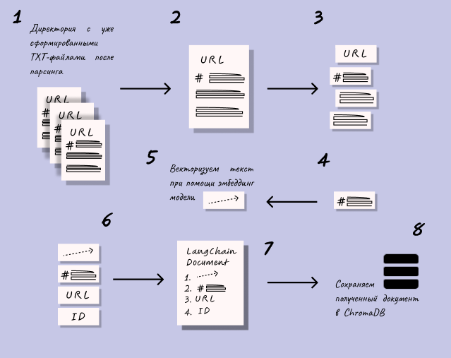
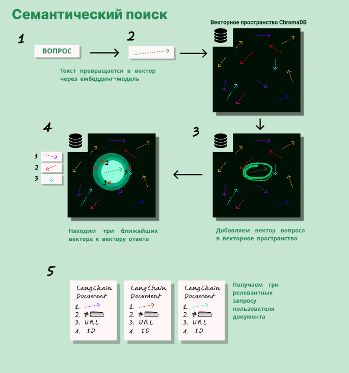
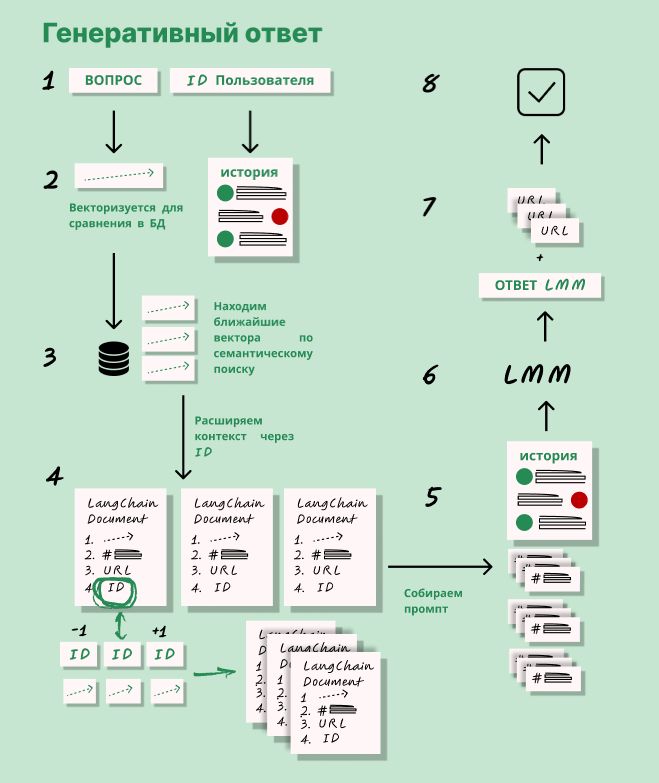
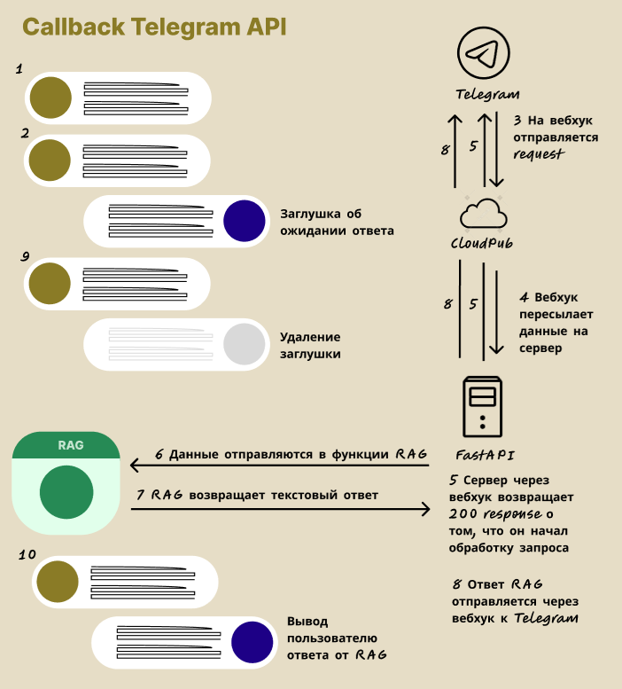

# Telegram Bot with RAG-based AI for University Applicants Assistance
## Description 

This Telegram bot uses RAG (Retrieval-Augmented Generation) technology to provide applicants with accurate information about university admissions. The system combines:
1. Data collection - automated parsing of university official websites
2. Vector storage - knowledge base using ChromaDB
3. Language model - Russian LLM model (T-Lite) from T-Bank
4. Telegram interface - convenient communication via messenger
The bot can answer complex questions about:
* Entrance exams
* Passing scores
* Specialties and faculties
* Required documents for admission
* Application deadlines
## 🚀 Quick Start
### System Requirements
* Python 3.10+
* 8+ GB RAM (16GB recommended for LLM)
### Installation Guide
1. Create virtual environment

```
python3 -m venv env
```

2. Activate virtual environment
    * Windows:

    ```
    .\env\Scripts\activate 
    ```

    * macOS/Linux:

    ```
    source env/bin/activate
    ```

3. Install dependencies

```
pip3 install -r requirements.txt
```

4. Configure OLLAMA
    1. Install Ollama client from (<https://ollama.com/>)
    2. Install LLM model locally (Russian model from T-Bank used in project)

    ```
    ollama run owl/t-lite
    ```

    3. Install embedding model locally (Multilingual model used in project)
    
    ```
    ollama pull mxbai-embed-large
    ```

5. Run scraper to collect data from domain

```
python3 scrapper.py
```

6. Run converter to process data and load into database

```
python3 ingest.py
```

7. Install CloudPub client from (<https://cloudpub.ru>)
8. Configure webhook for selected ```main.py``` port in client
9. Create bot in BotFather
10. Set bot TOKEN and webhook as environment variables

```
$env:TELEGRAM_BOT_TOKEN = "YOUR TOKEN" 
$env:APP_URL = "YOUR WEBHOOK"
```

11. Start server

```
fastapi run
```

## 🌐 Architecture and Workflow

### scrapper.py
Module collects data from university website:
* Recursively crawls all pages of specified domain
* Uses BeautifulSoup for HTML content parsing
* Extracts text content and metadata
* Processes PDF/DOCX documents (converts to text)
* Adds MD formatting to text when possible
* Saves results in TXT format to selected directory

### ingest.py
Module prepares data for vector database:
* Loads raw texts from selected directory
* Splits documents into chunks
* Vectorizes data
* Stores vectorized data in ChromaDB

### ollama.py
Module implements RAG logic:
* Vector search

* Response generation
    1. Forms prompt with context from retrieved documents
    2. Sends request to LLM model
    3. Processes streaming output

* Context reset
### main.py
Application core:
* Initializes FastAPI with CORS middleware
* Creates Telegram handlers
* Configures webhook for receiving updates
* Launches ASGI server for request processing

## 🤖 Bot Commands
* /start - Welcome message
* /reset - Reset dialog context
* Question... - Any text query about admissions
## 📜 License
Project distributed under MIT license.

